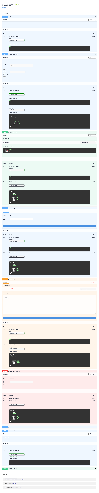
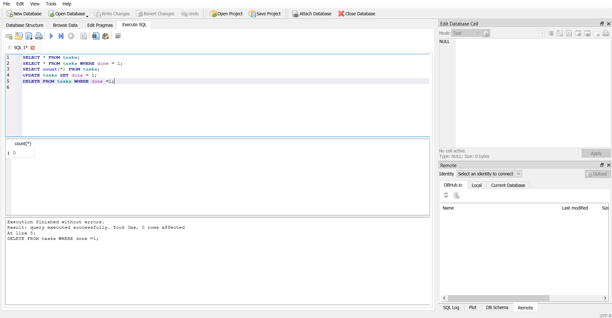

# Week 1: CRUD backend API
A small API that manages a task list: create, read, update, search, delete tasks.
# How to install/run API
Download/Extract this respository

Install python 3.10+

For Windows:

***
    python -m venv .venv
    .venv\Scripts\activate
    python -m pip install -r .\Backend\requirement.txt
    uvicorn Backend.CRUD:app --reload
***
| Endpoints | 
|-----------|
| POST /tasks |
| GET /tasks - GET /tasks?search={task} - GET /tasks?done={bool} - GET /tasks?search={task}&done={bool}  - GET /tasks/3 |
| GET /sort |
| PUT /tasks/3 |
| DELETE /tasks/3 |
| GET /stats |
| POST /reset |

curl -i -X PUT http://localhost:8000/tasks/4 -H "Content-Type: application/json" -d "{\"id\":\"4\",\"done\":\"true\"}"
HTTP/1.1 200 OK
date: Tue, 04 Aug 2026 21:47:35 GMT
server: uvicorn
content-length: 39
content-type: application/json

The tasks I created are not saved. The client is running a local list, and it is not sending any data across the network.

# Week 2 SQL database
I run this query: "SELECT count(*) FROM tasks;"
It returns a table with a cell with the number eight. The column has a label with "count(*)", and the row has a label with "1".

Why SQLite was chosen?
It is because SQLite is built into Python, so there is no need to install it. SQLite is serverless, self-contained, zero-configuration, and transactional feature. So there is no need to install a client. There is no need to mess with the configuration files.

The database lives at the root of the directory.

When adding the column created_at and updated_at, the table become wider. I have to edit a class for the new columns and methods.
How to run the database:

Download/Extract this respository

Install python 3.10+

For Windows:

***
    python -m venv .venv
    .venv\Scripts\activate
    python -m pip install -r .\Backend\requirement.txt
    uvicorn Backend.CRUD:app --reload
***

